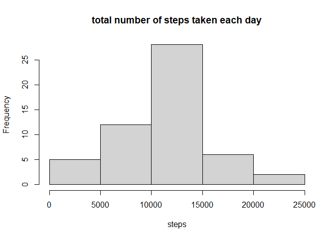
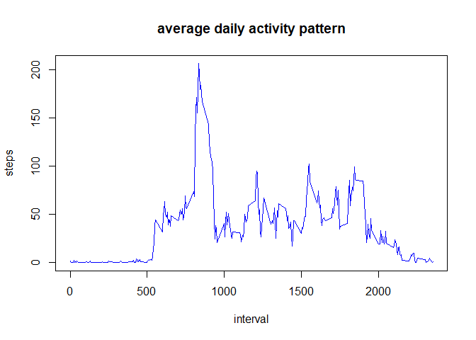
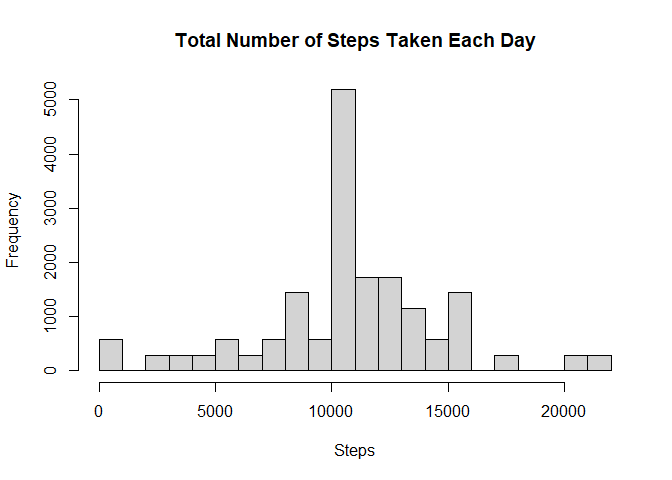

## Loading Required packages

    library(dplyr)

    ## 
    ## Attaching package: 'dplyr'

    ## The following objects are masked from 'package:stats':
    ## 
    ##     filter, lag

    ## The following objects are masked from 'package:base':
    ## 
    ##     intersect, setdiff, setequal, union

    library(ggplot2)

    ## Warning: package 'ggplot2' was built under R version 4.0.4

## Downloading and Processing the data

    url <- "https://d396qusza40orc.cloudfront.net/repdata%2Fdata%2Factivity.zip"
    dest <- "C:/Users/Mihaela/AppData/Roaming/SPB_16.6/R-test/datasciencecoursera/Explanatory_Data_Analysis/activity.zip"
    download.file(url,dest)
    data <- unz(dest,filename = "activity.csv")

Loading the csv file Once we load the file, we will compose two data
frames - one with NA (df.na) and one without NA(df)

    df <- read.table(data,
                     header = T,
                     sep = ",",
                     na.strings = "NA")
    df.na <- df
    df <- na.omit(df)

Using dplyr to sum the steps for each day and convert date to a date
format

    activity <- df %>% group_by(date) %>% summarise(steps = sum(steps)) %>% 
      mutate(date = as.Date(date, format = "%Y-%m-%d"))

## Histogram of the total number of steps taken each day and summary of the data

    hist(activity$steps, main = "total number of steps taken each day", xlab = "steps")

    summary(activity)

    ##       date                steps      
    ##  Min.   :2012-10-02   Min.   :   41  
    ##  1st Qu.:2012-10-16   1st Qu.: 8841  
    ##  Median :2012-10-29   Median :10765  
    ##  Mean   :2012-10-30   Mean   :10766  
    ##  3rd Qu.:2012-11-16   3rd Qu.:13294  
    ##  Max.   :2012-11-29   Max.   :21194

## What is the average daily activity pattern?

    activity_interval <- aggregate(steps ~ interval, df, mean)

    plot(activity_interval$interval,activity_interval$steps, type = "l",
         main = "average daily activity pattern", xlab = "interval", ylab = "steps",
         col = "blue")

Identifying the interval with maximum steps

    activity_interval[which.max(activity_interval$steps),]

    ##     interval    steps
    ## 104      835 206.1698

## Imputing missing values.

I have used dplyr to make new column with the data of the total steps
each day. And then replaced the NA with the average steps. for a day.

    sum(is.na(df.na))

    ## [1] 2304

    df_imputed <-df.na %>% 
                 mutate(date = as.Date(date, format = "%Y-%m-%d")) %>%
                 group_by(date) %>%
                 mutate(sum_steps = sum(steps))

    df_imputed$sum_steps[which(is.na(df_imputed$sum_steps))] = mean(df_imputed$sum_steps,na.rm = T)

Making a new histogram with the imputed data frame

    hist(df_imputed$sum_steps, main = "Total Number of Steps Taken Each Day", xlab = "Steps", breaks = 30)

## Are there differences in activity patterns between weekdays and weekends?

Preparing the data

The first thing we want to do is use the weekend function to transform
the dates to the names of each day. Then we will replace each day with
the corresponding label weekday or weekend.

    df_imputed$days <- weekdays(df_imputed$date)
    df_imputed$days <- ifelse(df_imputed$days=="Saturday" | df_imputed$days=="Sunday",
                              "weekend","weekday")

Because in the last example we imputed the data with the average of the
day. Now we have to impute using the average of each interval.

    df_imputed_intervals <-aggregate(steps~interval+days,data=df_imputed,FUN=mean,na.action=na.omit)

Plotting the result

    g <- ggplot(df_imputed_intervals, aes(interval,steps))
    g + facet_wrap(~days) + geom_line() 

